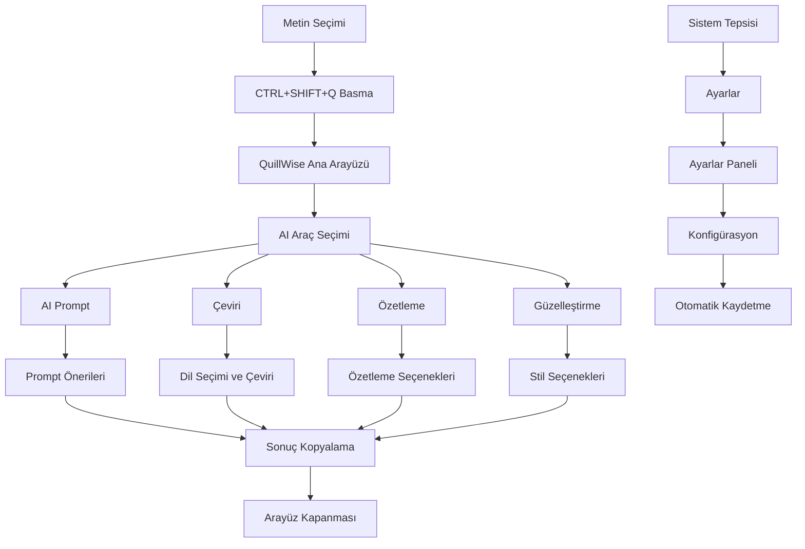

# QuillWise - Ürün Gereksinim Dokümantasyonu

## 1. Ürün Genel Bakış

QuillWise, kullanıcıların seçtikleri metinler için AI destekli yazma araçları sunan kapsamlı Windows masaüstü uygulamasıdır. Uygulama sistem tepsisinde çalışır ve CTRL+SHIFT+Q kısayolu ile aktif hale gelir.

Uygulama, AI prompt önerileri, metin çevirisi, özetleme ve metin güzelleştirme (polishing) özellikleri sunarak kullanıcıların yazma süreçlerini optimize eder. Özellikle içerik üreticileri, yazılımcılar, çevirmenler ve profesyonel yazarlar için tasarlanmıştır.

## 2. Temel Özellikler

### 2.1 Kullanıcı Rolleri

Bu uygulama tek kullanıcı odaklı olduğu için rol ayrımı gerektirmez. Tüm kullanıcılar aynı özelliklere erişebilir.

### 2.2 Özellik Modülü

QuillWise uygulaması aşağıdaki ana sayfalardan oluşur:

1. **Ana Arayüz**: AI araçları seçimi, seçili metin işleme, sonuç görüntüleme.
2. **AI Prompt Sayfası**: Prompt önerileri listesi, arama ve filtreleme, hızlı kopyalama.
3. **Çeviri Sayfası**: Dil seçimi, çeviri sonuçları, çeviri geçmişi.
4. **Özetleme Sayfası**: Özetleme seçenekleri, özetleme uzunluğu ayarları, özetleme sonuçları.
5. **Metin Güzelleştirme Sayfası**: Güzelleştirme türü seçimi, stil ayarları, karşılaştırma görünümü.
6. **Ayarlar Paneli**: Kısayol tuşları yapılandırması, UI tema seçenekleri, AI servis ayarları.
7. **Kütüphane Sayfası**: Kayıtlı içerikler, kategori yönetimi, favori öğeler.
8. **Sistem Tepsisi Menüsü**: Hızlı erişim, uygulama durumu, çıkış seçenekleri.

### 2.3 Sayfa Detayları

| Sayfa Adı             | Modül Adı              | Özellik Açıklaması                                                                 |
| --------------------- | ---------------------- | ---------------------------------------------------------------------------------- |
| Ana Arayüz            | AI Araç Seçimi         | Dört ana AI aracı (Prompt, Çeviri, Özetleme, Güzelleştirme) için büyük butonlar    |
| Ana Arayüz            | Metin Girişi           | Seçili metin gösterimi, manuel metin girişi, metin temizleme                       |
| Ana Arayüz            | Sonuç Görüntüleme      | İşlem sonuçları, kopyalama butonu, geçmiş erişimi                                  |
| AI Prompt Sayfası     | Prompt Önerileri       | Seçili metne göre AI prompt önerileri göster, önerileri kategorilere ayır          |
| AI Prompt Sayfası     | Hızlı Kopyalama        | Tek tıkla prompt kopyalama, otomatik panoya kopyalama, kopyalama onay bildirimi    |
| AI Prompt Sayfası     | Arama ve Filtreleme    | Prompt arama, kategori filtreleme, son kullanılan promptlar                        |
| Çeviri Sayfası        | Dil Seçimi             | Kaynak ve hedef dil seçimi, otomatik dil algılama, dil değiştirme                  |
| Çeviri Sayfası        | Çeviri İşlemi          | Metin çevirisi, çeviri kalitesi göstergesi, alternatif çeviriler                   |
| Çeviri Sayfası        | Çeviri Geçmişi         | Son çeviriler, favori çeviriler, çeviri kaydetme                                   |
| Özetleme Sayfası      | Özetleme Seçenekleri   | Özetleme türü (kısa/orta/uzun), özetleme stili (madde/paragraf), anahtar kelimeler |
| Özetleme Sayfası      | Özetleme Sonuçları     | Özetlenmiş metin, orijinal metin karşılaştırması, özetleme oranı                   |
| Güzelleştirme Sayfası | Stil Seçenekleri       | Yazım stili (formal/günlük/akademik), ton ayarları, hedef kitle seçimi             |
| Güzelleştirme Sayfası | Karşılaştırma          | Orijinal ve güzelleştirilmiş metin yan yana görünümü, değişiklik vurguları         |
| Ayarlar Paneli        | Kısayol Yapılandırması | Global hotkey değiştirme (CTRL+SHIFT+Q), özel kısayollar tanımlama                 |
| Ayarlar Paneli        | UI Konfigürasyonu      | Tema seçimi (açık/koyu), yazı tipi boyutu, pencere şeffaflığı                      |
| Ayarlar Paneli        | AI Servis Ayarları     | API anahtarları, servis sağlayıcı seçimi, kalite ayarları                          |
| Kütüphane Sayfası     | İçerik Yönetimi        | Kayıtlı promptlar, çeviriler, özetler ve güzelleştirilmiş metinler                 |
| Kütüphane Sayfası     | Kategori Sistemi       | Kategori oluşturma, renk kodlama, kategori bazlı organizasyon                      |
| Kütüphane Sayfası     | Favori Sistem          | Favori içerikler, hızlı erişim, kullanım sıklığı takibi                            |
| Sistem Tepsisi        | Durum Göstergesi       | Uygulama durumu, son işlem bilgisi, hızlı ayarlar                                  |

## 3. Temel Süreç

**Ana Kullanıcı Akışı:**

1. Kullanıcı herhangi bir uygulamada metin seçer
2. Kullanıcı CTRL+SHIFT+Q tuşlarına basar
3. QuillWise ana arayüzü açılır ve seçili metin gösterilir
4. Kullanıcı dört AI aracından birini seçer (Prompt, Çeviri, Özetleme, Güzelleştirme)
5. Seçilen araca göre ilgili sayfa açılır ve işlem gerçekleştirilir
6. Sonuç gösterilir ve kullanıcı kopyalar veya kaydeder
7. Arayüz kapanır ve kullanıcı sonucu istediği yere yapıştırır

**AI Prompt Akışı:**

1. Kullanıcı AI Prompt aracını seçer
2. Seçili metne göre prompt önerileri listelenir
3. Kullanıcı bir prompt seçer ve kopyalar
4. Prompt panoya kopyalanır

**Çeviri Akışı:**

1. Kullanıcı Çeviri aracını seçer
2. Kaynak dil otomatik algılanır, hedef dil seçilir
3. Çeviri işlemi gerçekleştirilir
4. Çeviri sonucu gösterilir ve kopyalanabilir

**Özetleme Akışı:**

1. Kullanıcı Özetleme aracını seçer
2. Özetleme türü ve uzunluğu seçilir
3. Metin özetlenir ve sonuç gösterilir
4. Özet kopyalanabilir veya kaydedilebilir

**Güzelleştirme Akışı:**

1. Kullanıcı Güzelleştirme aracını seçer
2. Yazım stili ve ton ayarları seçilir
3. Metin güzelleştirilir ve karşılaştırma gösterilir
4. Güzelleştirilmiş metin kopyalanabilir

**Ayarlar Yönetimi Akışı:**

1. Kullanıcı sistem tepsisindeki ikona sağ tıklar
2. "Ayarlar" menüsünü seçer
3. Ayarlar paneli açılır
4. Kullanıcı kısayol, tema ve AI servis ayarlarını değiştirir
5. Değişiklikler otomatik olarak kaydedilir

## 4. Kullanıcı Arayüzü Tasarımı

### 4.1 Tasarım Stili

* **Ana Renkler**: Birincil renk #7C3AED (mor), ikincil renk #F8FAFC (açık gri), vurgu rengi #10B981 (yeşil)

* **Buton Stili**: Yuvarlatılmış köşeler (12px), gradient efektleri, smooth hover animasyonları

* **Yazı Tipi**: Inter, 14px ana metin, 18px başlıklar, 24px ana başlık

* **Layout Stili**: Modern card-based tasarım, tab navigasyon, responsive grid sistem, glassmorphism efektleri

* **İkon Stili**: Lucide icons seti, 24px boyut, tutarlı çizgi kalınlığı, AI temalı ikonlar

### 4.2 Sayfa Tasarım Genel Bakışı

| Sayfa Adı             | Modül Adı         | UI Elementleri                                                                         |
| --------------------- | ----------------- | -------------------------------------------------------------------------------------- |
| Ana Arayüz            | AI Araç Butonları | 2x2 grid layout, büyük gradient butonlar, AI ikonları, hover animasyonları             |
| Ana Arayüz            | Metin Alanı       | Seçili metin gösterimi, manuel giriş alanı, temizleme butonu, karakter sayacı          |
| Ana Arayüz            | Sonuç Paneli      | Sonuç kartı, kopyalama butonu, kaydetme butonu, geçmiş erişimi                         |
| AI Prompt Sayfası     | Prompt Listesi    | Grid layout, card komponenti, hover efektleri, kategori renk kodları, kopyalama butonu |
| AI Prompt Sayfası     | Arama Bölümü      | Arama input'u, filtre dropdown'u, temizleme butonu, gerçek zamanlı arama               |
| Çeviri Sayfası        | Dil Seçici        | Dropdown menüler, dil bayrakları, değiştirme butonu, otomatik algılama toggle'ı        |
| Çeviri Sayfası        | Çeviri Paneli     | İki panel layout, kaynak/hedef metin alanları, çeviri butonu, kalite göstergesi        |
| Özetleme Sayfası      | Seçenekler        | Radio butonlar, slider kontroller, checkbox'lar, önizleme alanı                        |
| Özetleme Sayfası      | Sonuç Alanı       | Karşılaştırma paneli, özetleme oranı göstergesi, anahtar kelime vurguları              |
| Güzelleştirme Sayfası | Stil Kontrolleri  | Dropdown menüler, ton slider'ı, hedef kitle seçici, önizleme modu                      |
| Güzelleştirme Sayfası | Karşılaştırma     | Split view, değişiklik vurguları, kabul/reddet butonları, diff gösterimi               |
| Ayarlar Paneli        | Genel Ayarlar     | Tab navigasyon, form elementleri, toggle switch'ler, renk seçici                       |
| Ayarlar Paneli        | AI Ayarları       | API key input'ları, servis seçici dropdown'lar, test butonları                         |
| Kütüphane Sayfası     | İçerik Kartları   | Masonry layout, düzenleme ikonları, kategori etiketleri, favori yıldızı                |
| Sistem Tepsisi        | Menü              | Context menu, durum göstergesi, hızlı eylem butonları                                  |

### 4.3 Responsive Tasarım

Uygulama öncelikle Windows masaüstü için tasarlanmıştır. Pencere boyutları:

* Minimum: 400x300px

* Varsayılan: 600x500

