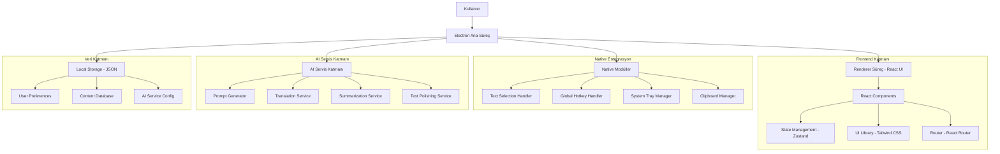
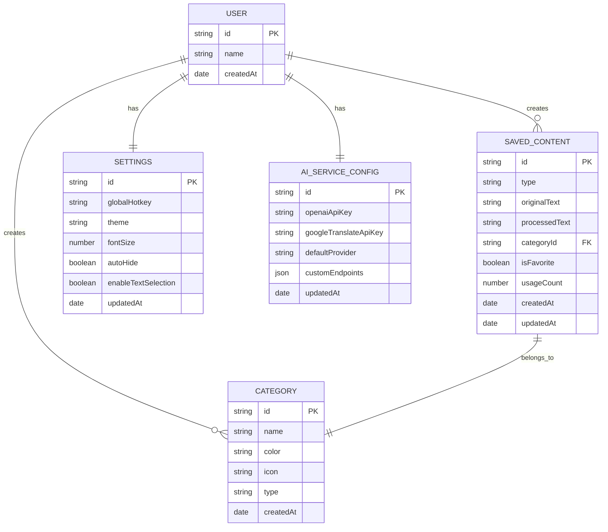

# QuillWise - Teknik Mimari Dokümantasyonu

## 1. Mimari Tasarım



## 2. Teknoloji Açıklaması

* **Frontend**: React\@18 + TypeScript + Tailwind CSS\@3 + Vite + React Router\@6

* **Desktop Framework**: Electron\@28

* **State Management**: Zustand\@4

* **AI Services**: OpenAI API, Google Translate API, Custom AI endpoints

* **Native Modules**:

  * node-global-key-listener (global hotkeys)

  * electron-clipboard-ex (gelişmiş clipboard işlemleri)

  * electron-store (veri saklama)

  * robotjs (metin seçimi algılama)

## 3. Route Tanımları

| Route      | Amaç                                                 |
| ---------- | ---------------------------------------------------- |
| /          | Ana arayüz, AI araç seçimi ve metin girişi           |
| /prompts   | AI prompt önerileri sayfası, arama ve filtreleme     |
| /translate | Çeviri sayfası, dil seçimi ve çeviri işlemleri       |
| /summarize | Özetleme sayfası, özetleme seçenekleri ve sonuçlar   |
| /polish    | Metin güzelleştirme sayfası, stil ve ton ayarları    |
| /settings  | Ayarlar paneli, kısayol ve AI servis konfigürasyonu  |
| /library   | İçerik kütüphanesi, kayıtlı içerikler ve kategoriler |
| /about     | Uygulama hakkında bilgi ve sürüm detayları           |

## 4. API Tanımları

### 4.1 Temel API

**IPC (Inter-Process Communication) Kanalları**

```typescript
// Ana süreç -> Renderer süreç
interface MainToRenderer {
  'text-selected': (text: string, context: TextContext) => void;
  'hotkey-pressed': (hotkey: string) => void;
  'settings-updated': (settings: AppSettings) => void;
  'ai-service-response': (response: AIServiceResponse) => void;
}

// Renderer süreç -> Ana süreç
interface RendererToMain {
  'copy-to-clipboard': (text: string) => void;
  'update-settings': (settings: Partial<AppSettings>) => void;
  'register-hotkey': (hotkey: string) => void;
  'show-window': () => void;
  'hide-window': () => void;
  'generate-prompts': (text: string, options: PromptOptions) => void;
  'translate-text': (text: string, options: TranslationOptions) => void;
  'summarize-text': (text: string, options: SummarizationOptions) => void;
  'polish-text': (text: string, options: PolishingOptions) => void;
  'save-content': (content: SavedContent) => void;
}
```

**Veri Tipleri**

```typescript
interface TextContext {
  applicationName: string;
  windowTitle: string;
  textLength: number;
  detectedLanguage: string;
  selectionMethod: 'hotkey' | 'manual';
}

interface AppSettings {
  globalHotkey: string; // CTRL+SHIFT+Q
  theme: 'light' | 'dark' | 'system';
  fontSize: number;
  autoHide: boolean;
  enableTextSelection: boolean;
  aiServices: AIServiceConfig;
}

interface AIServiceConfig {
  openaiApiKey?: string;
  googleTranslateApiKey?: string;
  customEndpoints?: CustomEndpoint[];
  defaultProvider: 'openai' | 'google' | 'custom';
}

interface CustomEndpoint {
  id: string;
  name: string;
  url: string;
  apiKey?: string;
  type: 'prompt' | 'translation' | 'summarization' | 'polishing';
}

interface Prompt {
  id: string;
  title: string;
  content: string;
  category: string;
  isFavorite: boolean;
  usageCount: number;
  createdAt: Date;
  updatedAt: Date;
}

interface TranslationOptions {
  sourceLang: string;
  targetLang: string;
  autoDetect: boolean;
}

interface SummarizationOptions {
  length: 'short' | 'medium' | 'long';
  style: 'bullet' | 'paragraph';
  keywords?: string[];
}

interface PolishingOptions {
  style: 'formal' | 'casual' | 'academic';
  tone: 'professional' | 'friendly' | 'neutral';
  targetAudience: string;
}

interface AIServiceResponse {
  type: 'prompt' | 'translation' | 'summarization' | 'polishing';
  result: string | string[];
  metadata?: any;
  error?: string;
}

interface SavedContent {
  id: string;
  type: 'prompt' | 'translation' | 'summary' | 'polished';
  originalText: string;
  processedText: string;
  category: string;
  isFavorite: boolean;
  createdAt: Date;
}

interface Category {
  id: string;
  name: string;
  color: string;
  icon: string;
  type: 'prompt' | 'translation' | 'summary' | 'polished' | 'all';
}
```

## 5. Sunucu Mimarisi

Bu uygulama tamamen client-side çalıştığı için sunucu mimarisi bulunmamaktadır. Tüm işlemler yerel olarak gerçekleştirilir.

## 6. Veri Modeli

### 6.1 Veri Modeli Tanımı



### 6.2 Veri Tanım Dili

**Electron Store Konfigürasyonu**

```typescript
// İçerik verisi
interface ContentStore {
  savedContent: SavedContent[];
  categories: Category[];
  lastUsed: string[];
  recentTranslations: TranslationHistory[];
}

// Ayarlar verisi
interface SettingsStore {
  globalHotkey: string; // varsayılan: 'Ctrl+Shift+Q'
  theme: 'light' | 'dark' | 'system'; // varsayılan: 'system'
  fontSize: number; // varsayılan: 14
  autoHide: boolean; // varsayılan: true
  enableTextSelection: boolean; // varsayılan: true
  windowBounds: {
    width: number;
    height: number;
    x?: number;
    y?: number;
  };
}

// AI Servis ayarları
interface AIServiceStore {
  openaiApiKey?: string;
  googleTranslateApiKey?: string;
  customEndpoints: CustomEndpoint[];
  defaultProvider: 'openai' | 'google' | 'custom';
  servicePreferences: {
    promptGeneration: string;
    translation: string;
    summarization: string;
    polishing: string;
  };
}

// Kullanım istatistikleri
interface StatsStore {
  totalUsage: number;
  serviceUsage: Record<string, number>;
  categoryUsage: Record<string, number>;
  languageUsage: Record<string, number>;
  lastActiveDate: Date;
}

interface TranslationHistory {
  id: string;
  sourceText: string;
  translatedText: string;
  sourceLang: string;
  targetLang: string;
  timestamp: Date;
}
```

**Varsayılan Veri**

```typescript
// Varsayılan kategoriler
const defaultCategories: Category[] = [
  {
    id: 'prompts',
    name: 'AI Promptlar',
    color: '#7C3AED',
    icon: 'brain',
    type: 'prompt'
  },
  {
    id: 'translations',
    name: 'Çeviriler',
    color: '#10B981',
    icon: 'languages',
    type: 'translation'
  },
  {
    id: 'summaries',
    name: 'Özetler',
    color: '#F59E0B',
    icon: 'file-text',
    type: 'summary'
  },
  {
    id: 'polished',
    name: 'Güzelleştirilmiş',
    color: '#EF4444',
    icon: 'sparkles',
    type: 'polished'
  },
  {
    id: 'writing',
    name: 'Yazma',
    color: '#3B82F6',
    icon: 'edit',
    type: 'all'
  },
  {
    id: 'business',
    name: 'İş',
    color: '#8B5CF6',
    icon: 'briefcase',
    type: 'all'
  }
];

// Varsayılan prompt şablonları
const defaultPromptTemplates: Prompt[] = [
  {
    id: 'improve-text',
    title: 'Metni İyileştir',
    content: 'Aşağıdaki metni daha açık, anlaşılır ve profesyonel hale getir:\n\n{text}',
    category: 'prompts',
    isFavorite: false,
    usageCount: 0,
    createdAt: new Date(),
    updatedAt: new Date()
  },
  {
    id: 'explain-code',
    title: 'Kodu Açıkla',
    content: 'Bu kodu satır satır açıkla ve ne yaptığını anlat:\n\n{text}',
    category: 'prompts',
    isFavorite: false,
    usageCount: 0,
    createdAt: new Date(),
    updatedAt: new Date()
  },
  {
    id: 'create-summary',
    title: 'Özet Oluştur',
    content: 'Bu metni kısa ve öz bir şekilde özetle:\n\n{text}',
    category: 'prompts',
    isFavorite: false,
    usageCount: 0,
    createdAt: new Date(),
    updatedAt: new Date()
  }
];

// Varsayılan dil seçenekleri
const supportedLanguages = [
  { code: 'tr', name: 'Türkçe', flag: '🇹🇷' },
  { code: 'en', name: 'English', flag: '🇺🇸' },
  { code: 'de', name: 'Deutsch', flag: '🇩🇪' },
  { code: 'fr', name: 'Français', flag: '🇫🇷' },
  { code: 'es', name: 'Español', flag: '🇪🇸' },
  { code: 'it', name: 'Italiano', flag: '🇮🇹' },
  { code: 'pt', name: 'Português', flag: '🇵🇹' },
  { code: 'ru', name: 'Русский', flag: '🇷🇺' },
  { code: 'ja', name: '日本語', flag: '🇯🇵' },
  { code: 'ko', name: '한국어', flag: '🇰🇷' },
  { code: 'zh', name: '中文', flag: '🇨🇳' },
  { code: 'ar', name: 'العربية', flag: '🇸🇦' }
];
```

**Dosya Yapısı**

```
%APPDATA%/quillwise/
├── content.json          # Kayıtlı içerikler ve kategoriler
├── settings.json         # Uygulama ayarları
├── ai-services.json      # AI servis konfigürasyonları
├── stats.json           # Kullanım istatistikleri
├── translation-history.json # Çeviri geçmişi
└── logs/                # Uygulama logları
    ├── main.log
    ├── renderer.log
    └── ai-services.log
```

